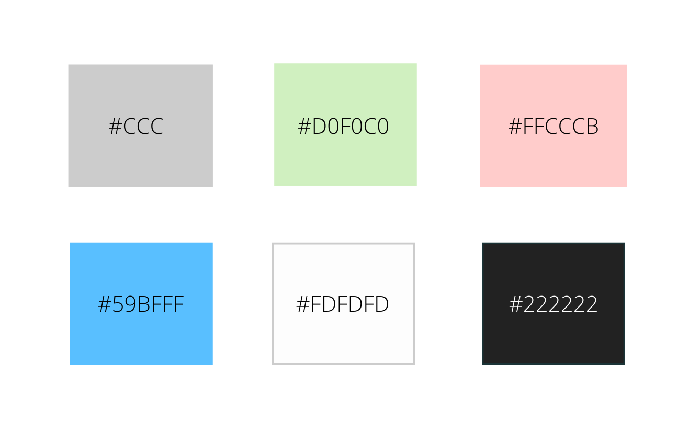

# FindDr.
- The project is a Proof-of-Concept for the idea which collaborates/connects the Patient, Doctor and Hospital fields.
- This document, the aplication apk, and the source code of the application is being submitted as discussed.
## Tech Stack


- <b>React Native:</b> React Native combines the best parts of native development with React, a best-in-class JavaScript library for building user interfaces.
- <b>Firebase Authentication:</b> Firebase Authentication provides backend services, easy-to-use SDKs, and ready-made UI libraries to authenticate users to your app.
- <b>Firebase Realtime Database:</b> The Firebase Realtime Database is a cloud-hosted database. Data is stored as JSON and synchronized in realtime to every connected client.
- <b>Firebase Storage:</b> FirebaseStorage is a service that supports uploading and downloading large objects to Google Cloud Storage. 


## Architecture
### App Flow


### Firebase Database Architecture

```
{
  "requests" : {
    "hospital" : {
      "H_1591291907268" : {
        "docInfo" : "Dr. Hema Nagaraj\n5678901234\nMBBS, MD",
        "doctorname" : "Dr. Dinesh Choudhary",
        "duration" : "12pm - 5pm (12th June)",
        "email" : "hospitaltest@gmail.com",
        "hospitaladdress" : "56, 6th Street, RT Nagar, Bangalore - 560056",
        "hospitalname" : "Ideal Nursing Home",
        "kmc" : "AxM24",
        "location" : "ICU",
        "phone" : "9980667890",
        "photo" : "",
        "qualifications" : "MBBS, MD",
        "status" : 2
      },
      "H_1591365837051" : {
        "doctorname" : "Dr. Dinesh Choudhary",
        "duration" : "5 hours - 16th June",
        "email" : "hospitaltest@gmail.com",
        "hospitaladdress" : "1234, Sixth Avenue, Coxtown, Bangalore - 560005",
        "hospitalname" : "Chia Care Center",
        "location" : "General Ward",
        "phone" : "9980667890",
        "photo" : "",
        "qualifications" : "MBBS",
        "status" : 0
      }
    },
    "patient" : {
      "P_1591291767313" : {
        "age" : "24",
        "complaints" : "Headache\nVomiting\nVertigo - 1 week",
        "docInfo" : "Dr. Hema Nagaraj\n5678901234\nMBBS, MD",
        "email" : "patienttest@gmail.com",
        "gender" : "Male",
        "kmc" : "AxM24",
        "name" : "Shiv Kumar",
        "phone" : "9987656789",
        "photo" : "https://firebasestorage.googleapis.com/v0/b/authentication-65bd1.appspot.com/o/profile%2FNDvfhDLzwqQRxa3E9HvwDXDn9tH2.jpg?alt=media&token=47769d3c-7767-44be-913e-4bd19796c2e5",
        "profilename" : "Shiv Kumar",
        "raddr" : "12, Sixth Cross, Avenue Road, Bangalore - 560008",
        "status" : 3
      },
      "P_1591292326259" : {
        "age" : "24",
        "complaints" : "Headache\n",
        "email" : "patienttest@gmail.com",
        "gender" : "Male",
        "name" : "Shiv Kumar",
        "phone" : "9987656789",
        "photo" : "https://firebasestorage.googleapis.com/v0/b/authentication-65bd1.appspot.com/o/profile%2FNDvfhDLzwqQRxa3E9HvwDXDn9tH2.jpg?alt=media&token=47769d3c-7767-44be-913e-4bd19796c2e5",
        "profilename" : "Shiv Kumar",
        "raddr" : "12, Sixth Cross, Avenue Road, Bangalore - 560008",
        "status" : 0
      }
    }
  },
  "users" : {
    "6FtKAqsWyggTLzQXkk09wcLLKCy1" : {
      "dname" : "Dr. Dinesh Choudhary",
      "email" : "hospitaltest@gmail.com",
      "myrequests" : {
        "H_1591291907268" : "",
        "H_1591365837051" : ""
      },
      "phone" : "9980667890",
      "photo" : "",
      "role" : 2
    },
    "NDvfhDLzwqQRxa3E9HvwDXDn9tH2" : {
      "age" : "24",
      "email" : "patienttest@gmail.com",
      "gender" : "Male",
      "myrequests" : {
        "P_1591291767313" : "",
        "P_1591292326259" : ""
      },
      "name" : "Shiv Kumar",
      "phone" : "9987656789",
      "photo" : "https://firebasestorage.googleapis.com/v0/b/authentication-65bd1.appspot.com/o/profile%2FNDvfhDLzwqQRxa3E9HvwDXDn9tH2.jpg?alt=media&token=47769d3c-7767-44be-913e-4bd19796c2e5",
      "raddr" : "12, Sixth Cross, Avenue Road, Bangalore - 560008",
      "role" : 0
    },
    "zgm8R9S2G1gYOLWftVv8nTPMJk22" : {
      "DOB" : "1-7-1988",
      "age" : "41",
      "college" : "Bangalore Medical College",
      "email" : "doctortest@gmail.com",
      "hospitalrequests" : {
        "H_1591291907268" : ""
      },
      "kmc" : "AxM24",
      "name" : "Dr. Hema Nagaraj",
      "patientrequests" : {
        "P_1591291767313" : ""
      },
      "phone" : "5678901234",
      "photo" : "",
      "qualifications" : "MBBS, MD",
      "raddr" : "23, Maple House Lane, Fraser Town, Bangalore - 560008",
      "role" : 1,
      "waddr" : "23, Maple House Lane, Fraser Town, Bangalore - 560008"
    }
  }
}

```

## Files
### Colour Scheme


### /App.js
- Initialize the app with Firebase credentials.
- Initialize Navigate Router for enabling app navigation.  
<br />

### /src/components/Root.js
- File used for Navigation.
- Uses stack, MaterialTopTab, and BottomTab Navigation.  
<br />

### /src/components/screens/Login.js
- User will be logged in using Firebase authentication methods.
- Patient (Role = 0) will be navigated to `PatientLoggedin`.
- Doctor (Role = 1) will be navigated to `DoctorLoggedin`.
- Hospital (Role = 2) will be navigated to `HospitalLoggedin`.  
<br />

### /src/components/screens/Patient/PatientSignup.js
### /src/components/screens/Doctor/DoctorSignup.js
### /src/components/screens/Hospital/HospitalSignup.js
- The above three files are used for signing up as a Patient, Doctor, or Hospital respectively.
- Name, email, address and other details (pertaining to category) will be added into the realtime database via Firebase authentication methods.
- Data stored under the `users/uid` node in the database.
- Image upload (optional) is handled by ImagePicker and ImageResizer packages.  
<br />

### /src/components/PatientRequestCard.js
### /src/components/HospitalRequestCard.js
- The above two files are used for rendering the card templates in the request screens.
- Receive data from the parent files via props.
- If status = 0, the template will appear in `PatientRequests`, `HospitalRequests`, `DocPatientRequest`, and `DocHospitalRequest`
- If status = 1/2/3, the template will appear in `DocPatientAccepted`, `DocHospitalAccepted`, `PatientAccepted`, and `HospitalAccepted`.   
<br />

### /src/components/screens/Patient/PatientRequestForm.js
### /src/components/screens/Hospital/HospitalRequestForm.js
- Used by Patient and Hospital respectively for filing requests.
- Request information will be stored in  the realtime database under the `requests/reqID/patient` and `requests/reqID/hospital` respectively.
- Listeners in `componentDidMount()` have been used to displayand/or store information, as well as to provide information for the 'Same as Profile' button in `PatientRequestForm`   
- Each request's `reqID` will be added under `users/uid/myrequests`
- Status is set to 0.   
<br />

### /src/components/screens/Patient/PatientProfile.js
### /src/components/screens/Doctor/DoctorProfile.js
### /src/components/screens/Hospital/HospitalProfile.js
- The above three files are used to display information about Patient, Doctor, and Hospital respectively entered during the signing up process.
- The information is obtained from the Firebase listener in `componentDidMount()` and is stored in a state variable: user.
- The information in these pages can be edited by pressing the 'Edit Profile' button. The updated information will be uppdated in the realtime database.
- Profile images can be edited as well. ImagePicker and ImageResizer packages are used for this.   
<br />

### /src/components/screens/Patient/PatientRequests.js
### /src/components/screens/Hospital/HospitalRequests.js
- In the  above two files, nested listeners are used to map the request IDs under the `requests/patient` and `requests/hospital` node with the `users/uid/myrequests` node for retrieval of data.
- Requests appear in these pages if their status = 0.
- If the 'X' button is pressed, the status is set to -1.   
<br />

### /src/components/screens/Patient/PatientAccepted.js
### /src/components/screens/Patient/PatientAccepted.js
- In the above two files, nested listeners are used to map the request IDs under the `requests/patient` and `requests/hospital` node with the `users/uid/myrequests` node for retrieval of data.
- Requests appear in these pages if their status = 1/2/3.
- If the '✓' button is pressed, the status is set to 2 (Request completed).
- If the 'X' button is pressed, the status is set to 3 (Request rejected).       
<br />

### /src/components/screens/Doctor/DocPatientRequests.js
### /src/components/screens/Doctor/DocHospitalRequests.js
- In the above two files, nested listeners are used to retrieve data from `requests/patient` and `requests/hospital` nodes.
- Requests appear in these pages if their status = 0.
- If the '✓' button is pressed, the status is set to 1 (Request accepted).
<br />

### /src/components/screens/Doctor/DocPatientAccepted.js
- In the above two files, nested listeners are used to map the request IDs under the `requests/patient` with the `users/uid/patientrequests` node respectively for retrieval of data.
- Requests appear in these pages if their status = 1/2/3.    
<br />

### /src/components/screens/Doctor/DocHospitalAccepted.js
- In the above two files, nested listeners are used to map the request IDs under the `requests/hospital` with the `users/uid/hospitalrequests` node respectively for retrieval of data.
- Requests appear in these pages if their status = 1/2/3.   
<br />

### Note:
- After official handing over of the application and the code associated with it, the config needs to be changed.
- This document is being submitted on account of ₹15,000/- and other added incentives after the delivery.
